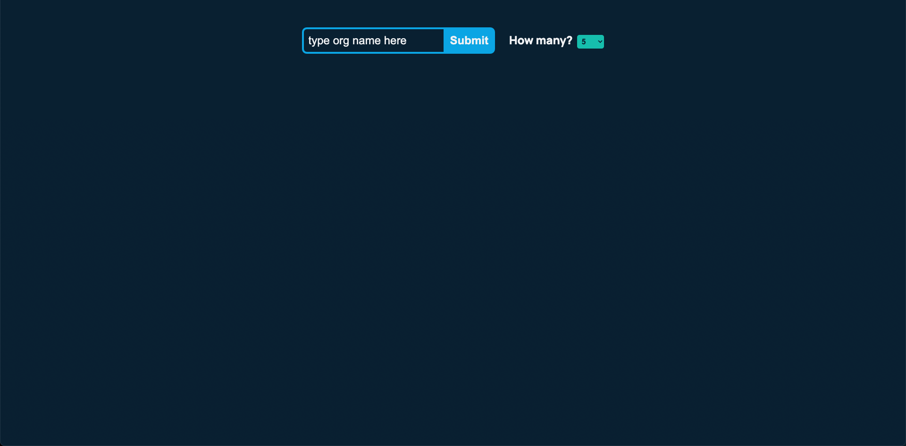
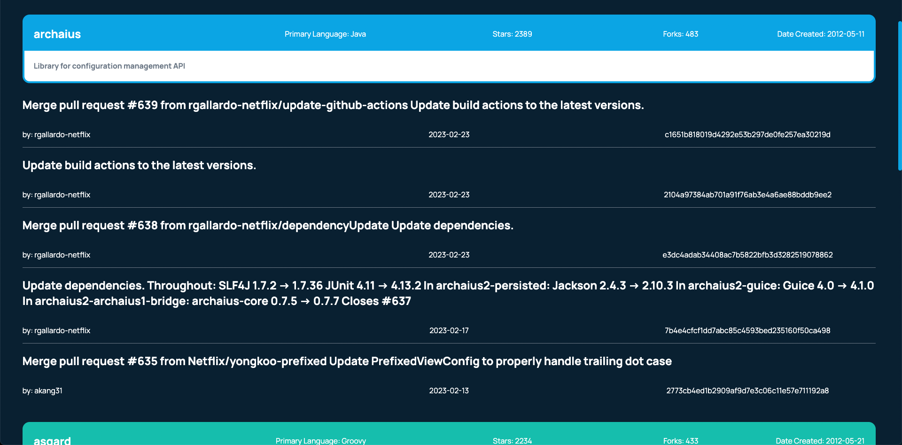

# Repo / Commit Navigator

  
  
  ## Deployed Link
  [https://repo-commit-navigator.herokuapp.com/](https://repo-commit-navigator.herokuapp.com/).
  
  ## Description
  
  This project allows a user to input an organization name and return a list of their repositories on github. Once the repositories are listed, the user can click a card to see the most recent commits to that repository.
  
  ## Table of Contents
  
  1. [Description](#description)
  2. [Installation](#installation)
  3. [Usage](#usage)
  4. [License](#license)
  5. [Contributors](#contributors)
  6. [Tests](#tests)
  7. [Questions](#questions)
  
  
  ## Usage
  
  When arriving to the page there is a textbox, a submit button, and a dropdown input. 

  
  
  The user can type in the name of an organization on GitHub and select how many repos they want to return from the dropdown and click submit or press enter on their keyboard.

  

  On submit, the page will render the selected number of repositories from the input organization. Showing the name of the repository, the number of stars, the number of forks, the date it was created, and the description. The cards are ordered by descending star count.

  

  Clicking a repo card will show the last 5 commits made to that repo. Showing the message, the author, the date is was created, and the hash associated with that repo. 

  
  
  ## Future Improvements
  
  It was important to submit as soon as I could, but if I had another day I would have liked to implement the following improvements:
  - caching searches for faster load times.
  - more on-screen feedback for better UX.
  - pagination for repos and commits for faster load times and better UX.
  
  
  ## Contributors
  
  [Andrew Cooke](https://github.com/andcooke)
  

  ## Questions
  
  If you have any questions you may email me at andcooke@duck.com.

  Or you may reach out at my LinkedIn: [Andrew Cooke](https://linkedin.com/in/andrew-l-cooke).
  
